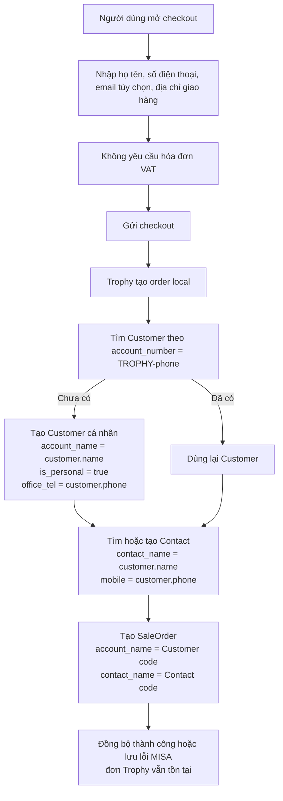
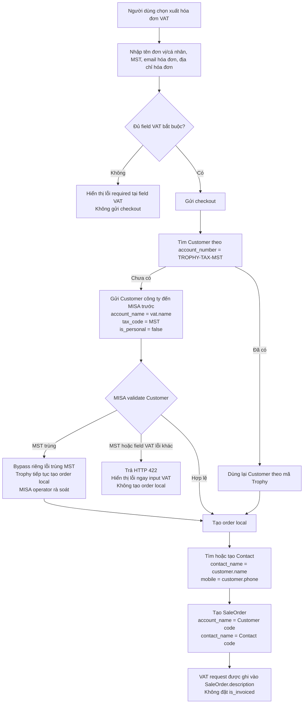
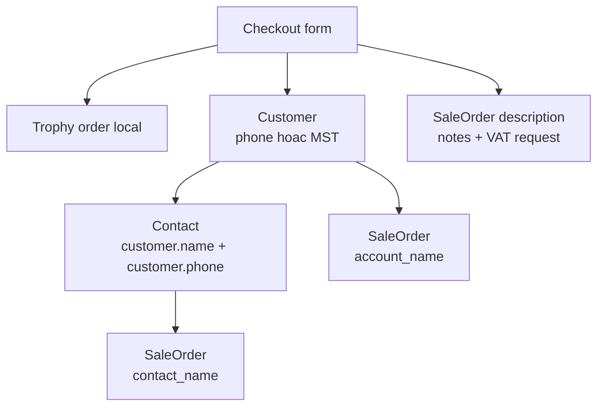

# Checkout -> MISA CRM v2 field mapping

> Phạm vi: mapping đang chạy trong code checkout của Trophy tại ngày 2026-08-15. Tài liệu mô tả **hành vi thực tế**, không phải đề xuất thay đổi.

## Kết luận cần review trước

1. Checkout **chưa có người nhận hàng riêng**. Contact MISA đang dùng tên và số điện thoại của người đặt hàng (`customer.name`, `customer.phone`).
2. `shipping_contact_name` nằm ngoài phạm vi tích hợp. Trophy không thử hoặc gửi field tenant-only này; SaleOrder liên kết người nhận qua `contact_name`.
3. Checkout chỉ hiển thị một địa chỉ giao hàng (`shipping.primaryAddress.line1`). Backend có schema cho địa chỉ chi tiết và người nhận khác, nhưng storefront hiện chưa gửi chúng.
4. Thông tin VAT tạo/cập nhật **Customer**. Trên **SaleOrder**, thông tin VAT chỉ được ghi vào `description`; không được dùng để đánh dấu hóa đơn đã xuất.
5. Checkout không gửi email, số điện thoại hoặc địa chỉ vào **Contact** ngoài `contact_name`, `mobile`, và `email` có điều kiện.

## Quy tắc ghi dữ liệu

| Điều kiện | Customer MISA |
| --- | --- |
| Checkbox VAT không chọn | Customer cá nhân, mã `TROPHY-<so-dien-thoai>`, `is_personal: true`. |
| Checkbox VAT được chọn | Checkout bắt buộc phải có thông tin VAT hợp lệ, gồm MST; Customer là Customer VAT, mã `TROPHY-TAX-<mst>`, `is_personal: false`, gửi `tax_code`. Không rơi về Customer cá nhân khi MST trống. |
| MST MISA báo trùng | Checkout vẫn tạo đơn local; MISA operator tự rà soát Customer trùng. |
| MST báo lỗi khác | Backend trả HTTP 422 và storefront hiển thị lỗi tại field VAT tương ứng. |
| SaleOrder báo Customer đã bị xóa | Trophy tạo lại Customer từ snapshot hiện tại và retry SaleOrder đúng một lần. Không dùng Customer/Contact ID MISA làm mapping. |

## Bảng mapping theo field checkout

`--` nghĩa là không gửi field đó vào resource tương ứng.

| Field trên checkout | Bắt buộc / điều kiện | Customer | Contact | SaleOrder | Ghi chú |
| --- | --- | --- | --- | --- | --- |
| `customer.name` - Họ và tên | Bắt buộc | `account_name`, trừ khi có `vat.taxId` và `vat.name` | `contact_name` | -- | Hiện là tên người đặt, cũng là tên Contact. |
| `customer.phone` - Số điện thoại | Bắt buộc | `office_tel`; tạo `account_number` cho Customer cá nhân | `mobile`; tạo `contact_code` | `phone` | Số được chuẩn hóa trước khi tạo mã `TROPHY-*`. |
| `customer.email` - Email | Tùy chọn | `office_email` nếu `vat.email` trống | `email` khi tạo Contact | -- | Nếu MISA đã có Contact email đó nhưng khác số điện thoại, Contact mới được tạo **không có email** để tránh lỗi trùng. |
| `shipping.primaryAddress.line1` - Địa chỉ giao hàng | Bắt buộc | `billing_address`, `billing_street`; `shipping_address`, `shipping_street` | -- | `billing_address`, `shipping_address`, `billing_street`, `shipping_street` | Vì storefront chỉ có một địa chỉ, cùng giá trị được dùng cho thanh toán và giao hàng. |
| `paymentMethod` - Chuyển khoản/COD | Bắt buộc | -- | -- | -- | Chỉ lưu tại Trophy để điều phối thanh toán. SaleOrder MISA không nhận field phương thức thanh toán từ checkout hiện tại. |
| `notes` - Ghi chú đơn hàng | Tùy chọn | -- | -- | `description` | Được đặt trong block `GHI CHU KHACH`. |
| Checkbox “Tôi muốn xuất hóa đơn VAT” | Tùy chọn | -- | -- | -- | Bật checkbox thì bốn input VAT bên dưới là bắt buộc. Không có field MISA trực tiếp. |
| `vat.name` - Tên đơn vị/cá nhân | Bắt buộc khi bật VAT | `account_name` | -- | `description` | Customer VAT luôn lấy tên này. |
| `vat.taxId` - Mã số thuế | Bắt buộc khi bật VAT | `tax_code`; quyết định Customer công ty và `account_number = TROPHY-TAX-<mst>` | -- | `description` | MISA là nơi validate MST. Duplicate MST là ngoại lệ được bypass; lỗi MST khác hiển thị ở form. |
| `vat.email` - Email nhận hóa đơn | Bắt buộc khi bật VAT | `office_email`, ưu tiên hơn `customer.email` | -- | `description` | Giữ riêng để vẫn có email gửi hóa đơn khi email cơ bản trống. Không gửi vào Contact. |
| `vat.address` - Địa chỉ hóa đơn | Bắt buộc khi bật VAT | `billing_address` | -- | `description` | SaleOrder vẫn lấy `billing_address` từ địa chỉ giao hàng checkout, không lấy VAT address. |
| Giỏ hàng: sản phẩm/biến thể | Có ít nhất một dòng | -- | -- | `sale_order_product_mappings[].product_code`, `amount`, `price`, `to_currency`, `description` | `product_code` là Trophy `product_variants.id` dạng string; không lấy SKU. |
| Số lượng | Có ít nhất một dòng | -- | -- | `sale_order_product_mappings[].amount` | Lấy từ cart line. |
| Đơn giá | Dữ liệu catalog đã resolve | -- | -- | `sale_order_product_mappings[].price` | Không phải input thủ công trên form. |
| Thành tiền dòng | Dữ liệu server tính | -- | -- | `sale_order_product_mappings[].to_currency` | Không phải input thủ công trên form. |
| Tổng đơn | Dữ liệu server tính | -- | -- | `sale_order_amount`, `total_summary` | Không phải input thủ công trên form. |

## Field MISA được tạo từ hệ thống, không phải input checkout

| Resource | Field | Giá trị hiện tại |
| --- | --- | --- |
| Customer | `form_layout` | `Mẫu tiêu chuẩn` |
| Customer | `is_personal` | `true` nếu không có MST; `false` nếu có MST. |
| Customer | `account_number` | `TROPHY-<phone>` hoặc `TROPHY-TAX-<mst>`. |
| Contact | `form_layout` | `Mẫu tiêu chuẩn` |
| Contact | `contact_code` | `TROPHY-<phone>` |
| Contact | `account_name` | `account_number` của Customer đã chọn. |
| SaleOrder | `form_layout` | `Mẫu tiêu chuẩn` |
| SaleOrder | `sale_order_no` | `PT-<orderNumber>` |
| SaleOrder | `sale_order_name` | `Trophy order <orderNumber>` |
| SaleOrder | `account_name` | `account_number` của Customer đã chọn. |
| SaleOrder | `contact_name` | `contact_code` của Contact đã chọn. |

## Mapping địa chỉ chi tiết: API nhận nhưng UI chưa có input

Backend contract có thể nhận `line2`, `city`, `province`, `postalCode`, `country`, và địa chỉ/người nhận khác. Storefront hiện chỉ gửi `line1`, nên các field dưới đây không có dữ liệu ở luồng checkout hiện tại.

| Field backend có thể nhận | Customer | Contact | SaleOrder |
| --- | --- | --- | --- |
| `shipping.primaryAddress.line2` | Ghép vào `billing_address` và `shipping_address` | -- | Ghép vào `billing_address` và `shipping_address` |
| `shipping.primaryAddress.city` / `province` | `billing_province`, `shipping_province` | -- | `billing_province`, `shipping_province` |
| `shipping.primaryAddress.postalCode` | `billing_code`, `shipping_code` | -- | `billing_code`, `shipping_code` |
| `shipping.primaryAddress.country` | `billing_country`, `shipping_country` | -- | `billing_country`, `shipping_country` |
| `shipping.differentAddress.recipientName` | -- | -- | -- |
| `shipping.differentAddress.recipientPhone` | -- | -- | -- |
| `shipping.differentAddress.address.*` | Chỉ thay thế nhóm `shipping_*` | -- | Chỉ thay thế nhóm `shipping_*` |

Hai field `recipientName` và `recipientPhone` chỉ được lưu trong snapshot địa chỉ khác ở Trophy; code MISA hiện tại **không map chúng** vào Contact hoặc SaleOrder. `shipping_contact_name` nằm ngoài phạm vi; không gửi hoặc thử field này.

## Luồng A: Không yêu cầu xuất hóa đơn VAT

Điều kiện: checkbox “Tôi muốn xuất hóa đơn VAT” không chọn.

### Dữ liệu MISA chính ở luồng A

| Resource | Dữ liệu nhận từ checkout |
| --- | --- |
| Customer | Tên, số điện thoại, email tùy chọn, địa chỉ giao hàng. |
| Contact | Tên, số điện thoại, email tùy chọn. |
| SaleOrder | Sản phẩm, số lượng, giá/tổng tiền, địa chỉ giao hàng, ghi chú đơn hàng. |

## Luồng B: Yêu cầu xuất hóa đơn VAT

Điều kiện: checkbox VAT được chọn. Checkout phải yêu cầu thông tin VAT trước khi gửi; nhánh tạo Customer VAT và kiểm tra MISA chạy trước khi tạo order local.

### Dữ liệu MISA chính ở luồng B

| Resource | Dữ liệu nhận từ checkout |
| --- | --- |
| Customer | `vat.name`, `vat.taxId`, `vat.email`, `vat.address`; đồng thời có số điện thoại khách và địa chỉ giao hàng. |
| Contact | Vẫn là tên/số điện thoại/email của **người đặt**, không phải dữ liệu VAT. |
| SaleOrder | Dữ liệu đơn như luồng A; yêu cầu VAT được thêm vào `description`, không phải trạng thái hóa đơn đã xuất. |

## Dòng chảy tổng quát

## Câu hỏi cần chốt khi review

1. Có thêm UI “người nhận hàng” riêng không? Nếu có, Contact nên dùng người nhận hay vẫn là người đặt?
2. Địa chỉ VAT có cần trở thành `SaleOrder.billing_address`, thay vì chỉ nằm trong `description`, không?
3. Có cần gửi phương thức thanh toán vào field/custom field MISA không? Public contract hiện dùng không có field đó.
4. Có cần gửi email/địa chỉ của người nhận vào Contact không? Hiện nay không gửi để giảm rủi ro uniqueness validation.
