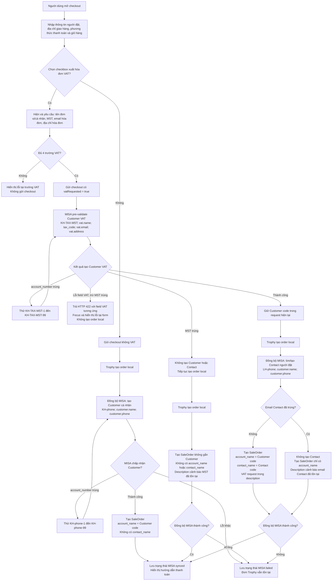

# Checkout -> MISA CRM v2 field mapping

> Phạm vi: mapping đang chạy trong code checkout của Trophy tại ngày 2026-08-15. Tài liệu mô tả **hành vi thực tế**, không phải đề xuất thay đổi.

## Kết luận cần review trước

1. Checkout **chưa có người nhận hàng riêng**. Contact MISA đang dùng tên và số điện thoại của người đặt hàng (`customer.name`, `customer.phone`).
2. `shipping_contact_name` trên SaleOrder nhận tên người mua (`customer.name`). `contact_name` vẫn là mã Contact MISA để tạo liên kết dữ liệu.
3. Checkout chỉ hiển thị một địa chỉ giao hàng (`shipping.primaryAddress.line1`). Backend có schema cho địa chỉ chi tiết và người nhận khác, nhưng storefront hiện chưa gửi chúng.
4. Có VAT: Customer chỉ nhận thông tin hóa đơn; Contact nhận form cơ bản, trừ khi email Contact đã trùng. Không VAT: Customer nhận form cơ bản và không tạo Contact.
5. Customer VAT đã được tạo để MISA kiểm tra được dùng ngay trong cùng request đồng bộ; Trophy không tạo Customer lần hai hay lưu mapping.
6. Trên **SaleOrder**, thông tin VAT chỉ được ghi vào `description` với nhãn `YEU CAU XUAT HOA DON`; không được dùng để đánh dấu hóa đơn đã xuất.

## Quy tắc ghi dữ liệu

| Điều kiện                                      | Customer MISA                                                                                                                                                                                            |
| ---------------------------------------------- | -------------------------------------------------------------------------------------------------------------------------------------------------------------------------------------------------------- |
| Checkbox VAT không chọn                        | Chỉ tạo Customer cá nhân từ form cơ bản, mã `KH-<so-dien-thoai>`, `is_personal: true`; không tạo Contact.                                                                                                |
| Checkbox VAT được chọn                         | Tạo Customer VAT chỉ từ thông tin hóa đơn, mã `KH-TAX-<mst>`, `is_personal: false`, gửi `tax_code`; tạo Contact từ form cơ bản với mã `LH-<so-dien-thoai>`. Không rơi về Customer cá nhân khi MST trống. |
| MST MISA báo trùng                             | Không tạo Customer hoặc Contact. Trophy tạo SaleOrder MISA không gắn `account_name`/`contact_name`; `description` tự ghi MST đã tồn tại và yêu cầu admin gắn Customer đúng thủ công.                     |
| Email Contact MISA báo trùng                   | Không retry tạo Contact. Trophy tạo SaleOrder có `account_name` nhưng không có `contact_name`; `description` tự ghi email đã tồn tại và yêu cầu admin gắn Contact đúng thủ công.                         |
| MST báo lỗi khác                               | Backend trả HTTP 422 và storefront hiển thị lỗi tại field VAT tương ứng.                                                                                                                                 |
| SaleOrder báo Customer đã bị xóa               | Trophy tạo lại Customer từ snapshot hiện tại và retry SaleOrder đúng một lần. Không dùng Customer/Contact ID MISA làm mapping.                                                                           |
| MISA báo lỗi `account_number` khi tạo Customer | Trophy thử mã gốc, sau đó lần lượt thử hậu tố `-1` đến `-99` (ví dụ `KH-090123-1`). Customer/Contact ID MISA không được lưu làm mapping.                                                                 |

## Bảng mapping theo field checkout

`--` nghĩa là không gửi field đó vào resource tương ứng.

| Field trên checkout                                 | Bắt buộc / điều kiện       | Customer                                                                   | Contact                      | SaleOrder                                                                                     | Ghi chú                                                                                                                       |
| --------------------------------------------------- | -------------------------- | -------------------------------------------------------------------------- | ---------------------------- | --------------------------------------------------------------------------------------------- | ----------------------------------------------------------------------------------------------------------------------------- |
| `customer.name` - Họ và tên                         | Bắt buộc                   | `account_name`, trừ khi có `vat.taxId` và `vat.name`                       | `contact_name`               | `shipping_contact_name`                                                                       | Tên người đặt, cũng là tên Contact và người nhận hàng hiển thị trên SaleOrder.                                                |
| `customer.phone` - Số điện thoại                    | Bắt buộc                   | `office_tel`; tạo `account_number` cho Customer cá nhân                    | `mobile`; tạo `contact_code` | `phone`                                                                                       | Số được chuẩn hóa trước khi tạo mã `KH-*` hoặc `LH-*`.                                                                        |
| `customer.email` - Email                            | Tùy chọn                   | `office_email` khi không VAT                                               | `email` khi tạo Contact VAT  | --                                                                                            | Chỉ tra Contact theo `contact_code`. Nếu MISA báo email trùng, không tạo Contact và ghi cảnh báo vào `SaleOrder.description`. |
| `shipping.primaryAddress.line1` - Địa chỉ giao hàng | Bắt buộc                   | `billing_address`, `billing_street`; `shipping_address`, `shipping_street` | --                           | `billing_address`, `shipping_address`, `billing_street`, `shipping_street`                    | Vì storefront chỉ có một địa chỉ, cùng giá trị được dùng cho thanh toán và giao hàng.                                         |
| `paymentMethod` - Chuyển khoản/COD                  | Bắt buộc                   | --                                                                         | --                           | --                                                                                            | Chỉ lưu tại Trophy để điều phối thanh toán. SaleOrder MISA không nhận field phương thức thanh toán từ checkout hiện tại.      |
| `notes` - Ghi chú đơn hàng                          | Tùy chọn                   | --                                                                         | --                           | `description`                                                                                 | Được đặt trong block `GHI CHU KHACH`.                                                                                         |
| Checkbox “Tôi muốn xuất hóa đơn VAT”                | Tùy chọn                   | --                                                                         | --                           | --                                                                                            | Bật checkbox thì bốn input VAT bên dưới là bắt buộc. Không có field MISA trực tiếp.                                           |
| `vat.name` - Tên đơn vị/cá nhân                     | Bắt buộc khi bật VAT       | `account_name`                                                             | --                           | `description`                                                                                 | Customer VAT luôn lấy tên này.                                                                                                |
| `vat.taxId` - Mã số thuế                            | Bắt buộc khi bật VAT       | `tax_code`; quyết định Customer công ty và `account_number = KH-TAX-<mst>` | --                           | `description`                                                                                 | MISA là nơi validate MST. Duplicate MST là ngoại lệ được bypass; lỗi MST khác hiển thị ở form.                                |
| `vat.email` - Email nhận hóa đơn                    | Bắt buộc khi bật VAT       | `office_email`, ưu tiên hơn `customer.email`                               | --                           | `description`                                                                                 | Giữ riêng để vẫn có email gửi hóa đơn khi email cơ bản trống. Không gửi vào Contact.                                          |
| `vat.address` - Địa chỉ hóa đơn                     | Bắt buộc khi bật VAT       | `billing_address`                                                          | --                           | `description`                                                                                 | SaleOrder vẫn lấy `billing_address` từ địa chỉ giao hàng checkout, không lấy VAT address.                                     |
| Giỏ hàng: sản phẩm/biến thể                         | Có ít nhất một dòng        | --                                                                         | --                           | `sale_order_product_mappings[].product_code`, `amount`, `price`, `to_currency`, `description` | `product_code` là Trophy `product_variants.id` dạng string; không lấy SKU.                                                    |
| Số lượng                                            | Có ít nhất một dòng        | --                                                                         | --                           | `sale_order_product_mappings[].amount`                                                        | Lấy từ cart line.                                                                                                             |
| Đơn giá                                             | Dữ liệu catalog đã resolve | --                                                                         | --                           | `sale_order_product_mappings[].price`                                                         | Không phải input thủ công trên form.                                                                                          |
| Thành tiền dòng                                     | Dữ liệu server tính        | --                                                                         | --                           | `sale_order_product_mappings[].to_currency`                                                   | Không phải input thủ công trên form.                                                                                          |
| Tổng đơn                                            | Dữ liệu server tính        | --                                                                         | --                           | `sale_order_amount`, `to_currency_summary`                                                    | Không phải input thủ công trên form.                                                                                          |
| Ngày tạo order                                      | Dữ liệu server tạo         | --                                                                         | --                           | `sale_order_date`                                                                             | Ngày tạo order theo múi giờ `Asia/Ho_Chi_Minh`, dạng `DD/MM/YYYY`.                                                            |

## Field MISA được tạo từ hệ thống, không phải input checkout

| Resource  | Field             | Giá trị hiện tại                                                                               |
| --------- | ----------------- | ---------------------------------------------------------------------------------------------- |
| Customer  | `form_layout`     | `Mẫu tiêu chuẩn`                                                                               |
| Customer  | `is_personal`     | `true` nếu không có MST; `false` nếu có MST.                                                   |
| Customer  | `account_number`  | `KH-<phone>` hoặc `KH-TAX-<mst>`; khi MISA từ chối đúng field này, thêm hậu tố `-1` đến `-99`. |
| Contact   | `form_layout`     | `Mẫu tiêu chuẩn`                                                                               |
| Contact   | `contact_code`    | `LH-<phone>`                                                                                   |
| Contact   | `account_name`    | `account_number` của Customer đã chọn.                                                         |
| SaleOrder | `form_layout`     | `Mẫu tiêu chuẩn`                                                                               |
| SaleOrder | `sale_order_no`   | `PT-<orderNumber>`                                                                             |
| SaleOrder | `sale_order_name` | `Trophy order <orderNumber>`                                                                   |
| SaleOrder | `sale_order_date` | Ngày tạo order, dạng `DD/MM/YYYY` theo múi giờ Việt Nam.                                       |
| SaleOrder | `account_name`    | `account_number` của Customer đã chọn.                                                         |
| SaleOrder | `contact_name`    | `contact_code` của Contact đã chọn.                                                            |

## Mapping địa chỉ chi tiết: API nhận nhưng UI chưa có input

Backend contract có thể nhận `line2`, `city`, `province`, `postalCode`, `country`, và địa chỉ/người nhận khác. Storefront hiện chỉ gửi `line1`, nên các field dưới đây không có dữ liệu ở luồng checkout hiện tại.

| Field backend có thể nhận                   | Customer                                         | Contact | SaleOrder                                        |
| ------------------------------------------- | ------------------------------------------------ | ------- | ------------------------------------------------ |
| `shipping.primaryAddress.line2`             | Ghép vào `billing_address` và `shipping_address` | --      | Ghép vào `billing_address` và `shipping_address` |
| `shipping.primaryAddress.city` / `province` | `billing_province`, `shipping_province`          | --      | `billing_province`, `shipping_province`          |
| `shipping.primaryAddress.postalCode`        | `billing_code`, `shipping_code`                  | --      | `billing_code`, `shipping_code`                  |
| `shipping.primaryAddress.country`           | `billing_country`, `shipping_country`            | --      | `billing_country`, `shipping_country`            |
| `shipping.differentAddress.recipientName`   | --                                               | --      | --                                               |
| `shipping.differentAddress.recipientPhone`  | --                                               | --      | --                                               |
| `shipping.differentAddress.address.*`       | Chỉ thay thế nhóm `shipping_*`                   | --      | Chỉ thay thế nhóm `shipping_*`                   |

Hai field `recipientName` và `recipientPhone` chỉ được lưu trong snapshot địa chỉ khác ở Trophy; code MISA hiện tại **không map chúng** vào Contact hoặc SaleOrder. `shipping_contact_name` luôn dùng `customer.name`, tức tên người mua, theo quy ước đã chốt.

## UML luồng checkout theo checkbox VAT

Checkbox “Tôi muốn xuất hóa đơn VAT” quyết định nhánh đồng bộ. Chỉ nhánh VAT tạo Contact và gửi `SaleOrder.contact_name`.

### Dữ liệu MISA chính ở nhánh VAT

| Resource  | Dữ liệu nhận từ checkout                                                                                                                                                                                           |
| --------- | ------------------------------------------------------------------------------------------------------------------------------------------------------------------------------------------------------------------ |
| Customer  | Chỉ `vat.name`, `vat.taxId`, `vat.email`, `vat.address`.                                                                                                                                                           |
| Contact   | Tên/số điện thoại/email của **người đặt**, không phải dữ liệu VAT; không tạo nếu email MISA đã trùng.                                                                                                              |
| SaleOrder | Dữ liệu đơn và yêu cầu VAT được thêm vào `description`, không phải trạng thái hóa đơn đã xuất. Khi MST hoặc email Contact trùng, `description` nêu liên kết Customer/Contact còn thiếu để admin đối soát thủ công. |

## Câu hỏi cần chốt khi review

1. Có thêm UI “người nhận hàng” riêng không? Nếu có, Contact nên dùng người nhận hay vẫn là người đặt?
2. Địa chỉ VAT có cần trở thành `SaleOrder.billing_address`, thay vì chỉ nằm trong `description`, không?
3. Có cần gửi phương thức thanh toán vào field/custom field MISA không? Public contract hiện dùng không có field đó.
4. Có cần gửi email/địa chỉ của người nhận vào Contact không? Hiện nay không gửi để giảm rủi ro uniqueness validation.
