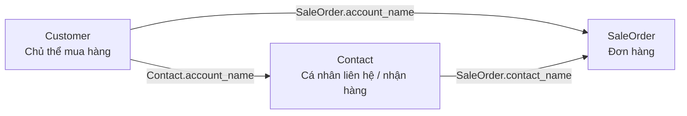

# MISA CRM v2: Customer, Contact va SaleOrder

> Bản tham chiếu này được tổng hợp ngày 2026-08-12 từ OpenAPI v2 của MISA CRM Connect và ba bản HTML đã lưu trong thư mục này. Đây là tài liệu đối chiếu cho Trophy, không thay thế tài liệu chính thức của MISA.

## Nguồn và phạm vi

- Tài liệu chính thức: [MISA CRM Connect v2](https://crmconnect.misa.vn/docs-v2/index.html)
- OpenAPI: `https://crmconnect.misa.vn/swagger/v2/swagger.json`
- HTML field export: `contract.html`, `customer.html`, `sale_order.html`
- Phạm vi: xác thực, `Customers`, `Contacts`, `SaleOrders` và các field cần cho checkout/hoa don VAT.

OpenAPI mô tả kiểu dữ liệu và tên field, nhưng không công bố toàn bộ rule bắt buộc/duy nhất theo tenant. MISA CRM có thể từ chối một field theo cấu hình của tenant dù schema không đánh dấu `required`.

## Xác thực và header

| Mục | Contract |
| --- | --- |
| Sinh token | `POST /api/v2/Account` |
| Body | `{"client_id":"...","client_secret":"..."}` |
| `client_id` | Tên ứng dụng do CRM cấp. |
| `client_secret` | Mã bảo mật do CRM cấp; chỉ lưu ở backend. |
| Header gọi API sau khi có token | `Authorization: Bearer <token>` và `Clientid: <client_id>` |

Không gửi `client_secret` xuống storefront hoặc admin browser.

## Bảng endpoint

Tất cả endpoint dưới đây có tiền tố `/api/v2`.

| Resource | Tạo | Cập nhật | Xóa | Danh sách | Theo ID | Theo mã |
| --- | --- | --- | --- | --- | --- | --- |
| Customer | `POST /Customers` | `PUT /Customers` | `DELETE /Customers` | `GET /Customers` | `GET /Customers/id` | `GET /Customers/code` |
| Contact | `POST /Contacts` | `PUT /Contacts` | `DELETE /Contacts` | `GET /Contacts` | `GET /Contacts/id` | `GET /Contacts/code` |
| SaleOrder | `POST /SaleOrders` | `PUT /SaleOrders` | `DELETE /SaleOrders` | `GET /SaleOrders` | `GET /SaleOrders/id` | `GET /SaleOrders/code` |

Các create/update/delete trong OpenAPI được mô tả là thao tác “theo danh sách”; payload hiện dùng là mảng object. Endpoint danh sách hỗ trợ phân trang (`page`, `pageSize`, `orderBy`, `isDescending`).

## Mô hình nghiệp vụ

- **Customer** có thể là công ty/tổ chức hoặc cá nhân. Khóa nghiệp vụ MISA dùng trong liên kết là `account_number`.
- **Contact** là cá nhân. `contact_code` là mã để tra cứu và `account_name` liên kết Contact với Customer.
- **SaleOrder** liên kết Customer qua `account_name` và Contact qua `contact_name`.
- Tên field có hậu tố `_name` là field tra cứu/liên kết theo mã theo cách MISA CRM hiển thị, không phải một khóa ngoại Trophy tự quản lý.

## Customer

### Field quan trọng

| Field | Kiểu | Ý nghĩa MISA | Dùng trong Trophy |
| --- | --- | --- | --- |
| `account_number` | string | Mã khách hàng | Khóa tra cứu Customer của Trophy. |
| `account_name` | string | Tên khách hàng | Tên cá nhân hoặc tên đơn vị xuất hóa đơn. |
| `is_personal` | boolean | Là KH cá nhân | `true` cho khách lẻ, `false` khi có thông tin VAT công ty. |
| `tax_code` | string | Mã số thuế | Gửi từ form VAT; MISA là nơi xác thực. |
| `office_email` | string | Email | Email hóa đơn/doanh nghiệp. |
| `office_tel` | string | Điện thoại | Số điện thoại công ty. |
| `billing_address` | string | Địa chỉ hóa đơn | Địa chỉ xuất hóa đơn. |
| `shipping_address` | string | Địa chỉ giao hàng | Địa chỉ giao hàng. |
| `description` | string | Mô tả | Ghi chú cho vận hành MISA. |
| `form_layout` | string | Bố cục | Trophy dùng `Mẫu tiêu chuẩn`. |

Field địa chỉ chi tiết được công bố: `billing_country`, `billing_province`, `billing_district`, `billing_ward`, `billing_street`, `billing_code`; và các bản `shipping_*` tương ứng.

### Tra cứu và giới hạn

- Có thể tra cứu **theo mã Customer**: `GET /Customers/code?code=<account_number>`.
- Có thể lấy theo ID và lấy danh sách phân trang.
- OpenAPI không có endpoint tra cứu Customer theo `tax_code`. Không dùng quét toàn bộ trang Customer làm cơ chế định danh tin cậy.
- Nếu MISA trả `tax_code: Giá trị của Mã số thuế đã bị trùng.`, đây là ràng buộc uniqueness của tenant MISA, không có nghĩa là Trophy đã có Customer tương ứng để tái sử dụng.

## Contact

### Field quan trọng

| Field | Kiểu | Ý nghĩa MISA | Dùng trong Trophy |
| --- | --- | --- | --- |
| `contact_code` | string | Mã liên hệ | Khóa tra cứu Contact. |
| `contact_name` | string | Họ và tên | Người nhận/liên hệ. |
| `account_name` | string | Tổ chức | Mã Customer để gắn Contact vào Customer. |
| `mobile` | string | ĐT di động | Số người nhận. |
| `email` | string | Email cá nhân | Chỉ gửi khi cần; tenant có thể bắt unique. |
| `office_email` | string | Email cơ quan | Thông tin email công việc. |
| `mailing_address` | string | Địa chỉ | Địa chỉ liên hệ. |
| `shipping_address` | string | Địa chỉ giao hàng | Địa chỉ nhận hàng. |
| `form_layout` | string | Bố cục | Trophy dùng `Mẫu tiêu chuẩn`. |

Field địa chỉ chi tiết: `mailing_country`, `mailing_province`, `mailing_district`, `mailing_ward`, `mailing_street`, `mailing_zip`; và các bản `shipping_*` tương ứng.

### Tra cứu và cập nhật liên kết

- Tra cứu theo mã: `GET /Contacts/code?code=<contact_code>`.
- Khi chỉ cần gắn Contact cũ vào Customer, payload `PUT /Contacts` tối thiểu nên chỉ có `form_layout`, `contact_code`, `account_name`.
- Không đưa lại `email`, `mobile`, tên hoặc các field không đổi vào cập nhật liên kết. MISA vẫn có thể xác thực các field đó và trả lỗi trùng email/số điện thoại dù mục đích chỉ là gắn Customer.

## SaleOrder

### Field header quan trọng

| Field | Kiểu | Ý nghĩa MISA | Dùng trong Trophy |
| --- | --- | --- | --- |
| `sale_order_no` | string | Số đơn hàng | Số đơn hàng công khai của Trophy. |
| `sale_order_date` | string | Ngày đặt hàng | Ngày tạo đơn của Trophy theo múi giờ Việt Nam, dạng `DD/MM/YYYY`. |
| `account_name` | string | Khách hàng | Mã Customer. |
| `contact_name` | string | Liên hệ | Mã Contact/người nhận. |
| `shipping_contact_name` | string | Người nhận hàng | Tên người mua từ checkout (`customer.name`). |
| `sale_order_amount` | number | Giá trị đơn hàng | Tổng giá trị đơn. |
| `total_summary` | string | Tổng tiền | Tổng tiền theo format tenant. |
| `tax_summary` | string | Tiền thuế | Tổng thuế. |
| `discount_summary` | string | Tiền chiết khấu | Tổng chiết khấu. |
| `to_currency_summary` | string | Thành tiền | Tổng cuối cùng. |
| `description` | string | Mô tả | Ghi chú đơn và block thông tin VAT. |
| `shipping_address` | string | Địa chỉ giao hàng | Snapshot giao hàng. |
| `billing_address` | string | Địa chỉ hóa đơn | Snapshot hóa đơn. |
| `form_layout` | string | Bố cục | Trophy dùng `Mẫu tiêu chuẩn`. |

OpenAPI cũng công bố các trạng thái như `status`, `delivery_status`, `pay_status`, `revenue_status`, `is_invoiced`, `invoiced_amount`, `total_receipted_amount`. Chúng là trạng thái vận hành/hậu phát sinh; không tự đặt `is_invoiced` chỉ vì người mua đã yêu cầu xuất hóa đơn VAT.

### Dòng hàng hóa

Payload tạo SaleOrder chứa danh sách hàng hóa. Các field cần đối chiếu khi sync:

| Field | Ý nghĩa |
| --- | --- |
| `product_code` | Mã hàng hóa. Trophy dùng string của `product_variants.id`. |
| `product_name` | Tên hàng hóa. |
| `quantity` | Số lượng. |
| `price` | Đơn giá. |
| `tax_rate` | Thuế suất VAT. |
| `to_currency` | Thành tiền dòng. |

## Lỗi thường gặp khi tạo/cập nhật

| MISA trả về | Nguyên nhân điển hình | Cách xử lý trong checkout |
| --- | --- | --- |
| `tax_code: Giá trị của trường không hợp lệ` | MST không hợp lệ theo MISA/tenant. | Hiển thị nguyên văn tại field MST. |
| `tax_code: Giá trị của Mã số thuế đã bị trùng.` | Customer MISA khác đã dùng MST; API công khai không tra cứu được bằng MST. | Trophy cho đơn local tiếp tục, lưu thông tin VAT để nhân viên MISA rà soát. Không áp dụng bypass cho lỗi MST khác. |
| `email: Giá trị của Email cá nhân đã bị trùng.` | Contact khác đã sở hữu email. | Không dò hoặc tái sử dụng Contact theo email. Retry tạo đúng Contact code nhưng bỏ field `email`. |
| Lỗi trùng `mobile`/điện thoại | Tenant đặt uniqueness cho số liên hệ. | Tra cứu theo `contact_code` trước; không có mã/ID tra cứu thì third-party không thể khẳng định record cần tái dùng. |
| `Không được để trống` | Field bắt buộc do form layout hoặc tenant cấu hình. | Ghi log payload đã được che dữ liệu nhạy cảm, đối chiếu form layout và yêu cầu của MISA tenant. |
| HTTP 200 nhưng body báo validate error | MISA có thể biểu diễn lỗi nghiệp vụ trong response thành công HTTP. | Đọc `error_message`/validation result, không chỉ dựa vào status HTTP. |

## Quy ước hiện tại của Trophy

Các quy ước dưới đây là quyết định tích hợp của Trophy, không phải contract do MISA đảm bảo:

| Đối tượng | Quy ước Trophy |
| --- | --- |
| Customer cá nhân | `account_number = KH-<so-dien-thoai-da-chuan-hoa>` |
| Customer VAT | `account_number = KH-TAX-<mst-da-chuan-hoa>`, `tax_code = MST`, `is_personal = false` |
| Trùng/lỗi `account_number` | Thử mã gốc rồi thêm hậu tố `-1` đến `-99`; chỉ áp dụng khi MISA chỉ rõ lỗi thuộc field `account_number`. |
| Contact | `contact_code = LH-<so-dien-thoai-da-chuan-hoa>` |
| Liên kết | Gửi Customer code vào `Contact.account_name` và `SaleOrder.account_name`; gửi Contact code vào `SaleOrder.contact_name`. |
| Mapping | Không có bảng mapping bền vững giữa Trophy và MISA. Các mã do Trophy tạo là cách tra cứu duy nhất có thể dựa vào API công khai. |
| MST trùng | Chỉ bypass đúng lỗi duplicate MST để local checkout không bị chặn; không coi đó là đã tái sử dụng được Customer MISA. |

## Checklist khi đối chiếu API mới

1. Xác nhận endpoint và query param từ OpenAPI hiện hành, đặc biệt `id`/`ids` và `code`.
2. So sánh field name, kiểu dữ liệu, field danh sách và `form_layout` với tài liệu này.
3. Thử trên đúng tenant MISA vì mandatory/unique rule có thể khác OpenAPI.
4. Kiểm tra cả HTTP status lẫn validation result trong body.
5. Không giả định có thể đọc `contact_code`, `account_number`, Customer theo MST hoặc Contact theo email nếu quyền third-party không cấp endpoint đó.
6. Cập nhật tài liệu này cùng code và test contract khi MISA thay đổi.
